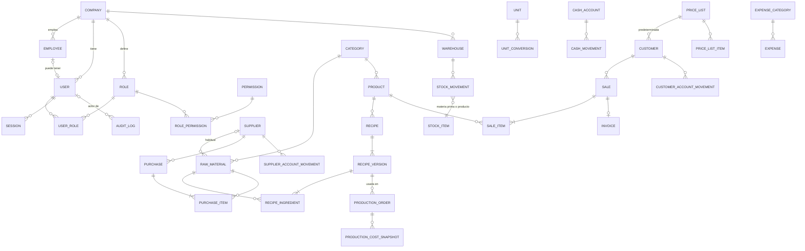

# Modelo de dominio

Este documento describe las entidades previstas y sus relaciones. **Solo las marcadas como
"Fase 0" existen hoy en la base.** El resto es diseño de referencia y se implementará (y podrá
ajustarse) en la fase indicada, cada una con su propia migración.

Convenciones:

- Todas las entidades de negocio tienen `company_id` (una empresa operativa en el MVP; sin
  bloquear multiempresa).
- Identificadores UUID. Marcas de tiempo `timestamptz`. Dinero y cantidades `numeric`.
- **Maestros** (se editan, se activan/desactivan) vs **transacciones** (documentos con estados;
  una vez confirmados no se borran ni editan: se cancelan o revierten con operaciones explícitas).
- Estados de documentos como enums con transiciones validadas; nunca banderas booleanas sueltas.

## Diagrama ER

Línea continua: Fase 0 (existe). Resto: previsto.

## Fase 0 — Fundación (implementado)

| Entidad          | Descripción                                                                                                                       |
| ---------------- | --------------------------------------------------------------------------------------------------------------------------------- |
| `Company`        | Empresa: razón social, nombre comercial, CUIT, contacto, logo, moneda (ARS), zona horaria, `settings` JSON.                       |
| `Employee`       | Persona que trabaja en la empresa. Puede existir sin usuario. Estado `ACTIVE`/`ON_LEAVE`/`INACTIVE`.                              |
| `User`           | Identidad de acceso. Email único (sin distinguir mayúsculas), hash Argon2id, estado `ACTIVE`/`DISABLED`, empleado opcional (1:1). |
| `Role`           | Rol por empresa (`code` único por empresa). `is_system` marca los 7 roles iniciales. Roles como datos.                            |
| `Permission`     | Catálogo global de permisos `modulo.accion`, sincronizado desde `@bakery/shared`.                                                 |
| `RolePermission` | N:M rol ↔ permiso.                                                                                                                |
| `UserRole`       | N:M usuario ↔ rol, con quién y cuándo lo asignó.                                                                                  |
| `Session`        | Sesión de servidor: hash del token, expiración, revocación, IP, user-agent.                                                       |
| `AuditLog`       | Registro solo-inserción: actor, acción, entidad, id, metadata (sin secretos), request id, IP, timestamp.                          |

**Autorización:** siempre por permiso, nunca por código de rol. ADMIN y DUEÑO reciben todos los
permisos del catálogo como filas explícitas (no hay comodín). Cada fase agrega sus permisos al
catálogo y ajusta los roles de sistema; `pnpm db:sync-reference` los aplica.

## Maestros previstos (Fase 1)

| Entidad          | Campos principales / notas                                                                                                                                                                                           |
| ---------------- | -------------------------------------------------------------------------------------------------------------------------------------------------------------------------------------------------------------------- |
| `Customer`       | código, razón social, nombre comercial, CUIT, contacto, dirección, localidad, tipo (consumidor, comercio, mayorista, distribuidor, otro), condición comercial, lista de precios, límite de crédito opcional, estado. |
| `Supplier`       | código, razón social, CUIT, contacto, condición de pago, estado.                                                                                                                                                     |
| `Unit`           | kg, g, l, ml, unidad, docena, bolsa, caja. Dimensión (masa, volumen, conteo, empaque).                                                                                                                               |
| `UnitConversion` | factor explícito origen→destino (`numeric`). Sin conversiones implícitas; la función de conversión es pura y testeada. Bolsa/caja se convierten por ítem (una bolsa de harina = 25 kg), no globalmente.              |
| `Category`       | categorías de materias primas y productos.                                                                                                                                                                           |
| `RawMaterial`    | código, nombre, categoría, unidad base, costo actual, stock mínimo, proveedor habitual, activo. **Sin stock editable.**                                                                                              |
| `Product`        | código, nombre, categoría, descripción, unidad de venta, precio, controla stock, imagen, estado.                                                                                                                     |
| `Warehouse`      | depósito. Inicialmente "DEPÓSITO PRINCIPAL".                                                                                                                                                                         |

## Recetas (Fase 2)

- `Recipe` (producto, nombre) → `RecipeVersion` (número, rendimiento esperado y unidad, merma %
  opcional, instrucciones, activa desde, estado `DRAFT`/`ACTIVE`/`ARCHIVED`) →
  `RecipeIngredient` (materia prima, cantidad, unidad).
- Una versión usada en producción es **inmutable**. Cambiar la receta = nueva versión; la anterior
  se archiva. Las órdenes históricas conservan su referencia.
- Costo teórico = Σ (cantidad convertida a unidad base × costo actual) / rendimiento.

## Inventario (Fase 3)

`StockMovement`: depósito, tipo de ítem (`RAW_MATERIAL`/`PRODUCT`), ítem, cantidad con signo,
unidad, fecha, tipo (`PURCHASE_RECEIPT`, `PRODUCTION_CONSUMPTION`, `PRODUCTION_OUTPUT`, `SALE`,
`ADJUSTMENT_POSITIVE`, `ADJUSTMENT_NEGATIVE`, `WASTE`, `RETURN`, `INITIAL_STOCK`),
`reference_type`/`reference_id` (documento origen), usuario, observación, costo unitario.

- **El stock es la suma de movimientos.** Si por rendimiento se agrega un saldo cacheado, se
  actualiza en la misma transacción que el movimiento y existe un proceso de reconciliación.
- Idempotencia: restricción única sobre (`reference_type`, `reference_id`, línea, tipo) para que un
  documento no genere movimientos dos veces.
- Mermas (`WASTE`) con motivo: `VENCIMIENTO`, `ERROR_PRODUCCION`, `ROTURA`, `CALIDAD`, `AJUSTE`, `OTRO`.

## Compras (Fase 3)

`Purchase` (proveedor, fecha, comprobante, estado `DRAFT` → `RECEIVED`; estado de pago
`PENDING`/`PARTIAL`/`PAID`, subtotal, impuestos, total) + `PurchaseItem`. Recibir la compra en una
transacción: movimientos positivos, recálculo de costo por **promedio ponderado móvil** (función de
dominio única), movimiento en cuenta del proveedor, auditoría.

## Producción (Fase 4)

`ProductionOrder` (producto, versión de receta, cantidad planificada/real, fecha, responsable,
estado `DRAFT`/`PLANNED`/`IN_PROGRESS`/`COMPLETED`/`CANCELLED`). Completar, en una transacción:
validar disponibilidad → consumos negativos → costo real y teórico → `ProductionCostSnapshot` →
salida positiva de producto → rendimiento real y merma.

## Ventas y cuentas (Fases 5–6)

- `Sale` (`DRAFT`/`CONFIRMED`/`PARTIALLY_PAID`/`PAID`/`CANCELLED`) + `SaleItem`. Confirmar descuenta
  stock una sola vez; cancelar genera movimientos inversos.
- `PriceList` + `PriceListItem`; cada cliente con lista predeterminada.
- `CustomerAccountMovement` (`SALE`, `PAYMENT`, `CREDIT_NOTE`, `ADJUSTMENT`) y
  `SupplierAccountMovement` (`PURCHASE`, `PAYMENT`, `DEBIT`, `CREDIT`, `ADJUSTMENT`): el saldo es la
  suma del ledger.
- `CashAccount` + `CashMovement` (`SALE_INCOME`, `CUSTOMER_PAYMENT`, `SUPPLIER_PAYMENT`, `EXPENSE`,
  `ADJUSTMENT`, `OTHER_INCOME`, `OTHER_EXPENSE`), medios de pago (efectivo, transferencia, débito,
  crédito, cuenta corriente, otro). Resumen diario.
- `Expense` + `ExpenseCategory`.

## Facturación (Fase 7)

`Invoice` (venta, cliente, tipo, número, fecha, subtotal, impuestos, total, estado). Emisión a
través de la interfaz `TaxInvoiceProvider`; implementación inicial `InternalInvoiceProvider`. La
integración fiscal argentina (`ArgentinaFiscalInvoiceProvider`) es un milestone aparte.

## Invariantes críticas

| Área       | Invariante                                                                  | Cómo se garantiza / testea                                                      |
| ---------- | --------------------------------------------------------------------------- | ------------------------------------------------------------------------------- |
| Auditoría  | Las operaciones sensibles registran actor y timestamp. El log no se altera. | **Fase 0:** trigger que rechaza UPDATE/DELETE; tests de login/logout auditados. |
| Seguridad  | Autorización validada en backend por permiso.                               | **Fase 0:** tests 401/403 en rutas protegidas.                                  |
| Inventario | Todo cambio de stock tiene un `StockMovement`.                              | Fase 3: sin columna de stock editable; tests de integración.                    |
| Producción | Completar genera consumo + salida en una única transacción.                 | Fase 4: test de rollback provocando falla.                                      |
| Recetas    | Una producción referencia una versión inmutable.                            | Fase 2: test v1 intacta tras crear v2.                                          |
| Compras    | Una compra recibida afecta stock una sola vez.                              | Fase 3: transición de estado + restricción única + test de doble ejecución.     |
| Ventas     | Una venta confirmada afecta stock una sola vez.                             | Fase 5: ídem.                                                                   |
| Costos     | Producciones históricas conservan snapshot de costos.                       | Fase 4.                                                                         |
| Caja       | Todo movimiento financiero relevante es trazable a su origen.               | Fase 6: referencia obligatoria salvo movimientos manuales con motivo.           |
