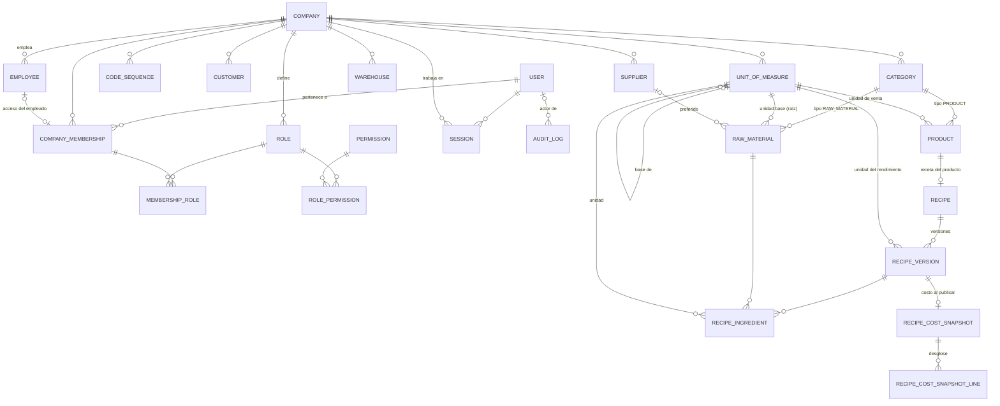
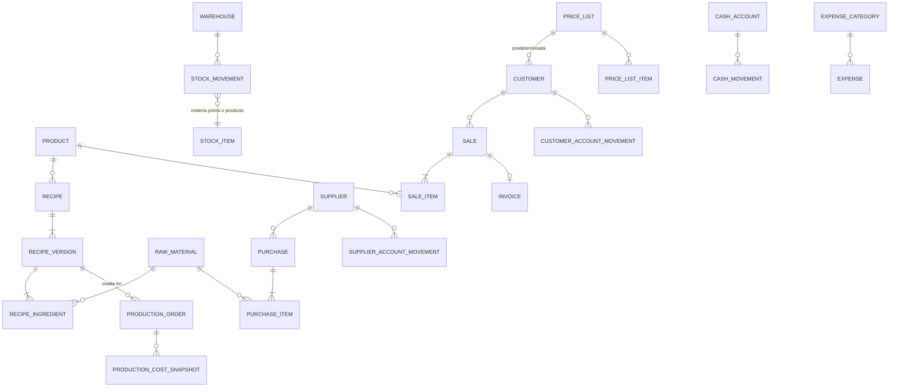

# Modelo de dominio

Este documento describe las entidades del sistema y sus relaciones. **Las de las Fases 0 y 1
existen hoy en la base.** El resto es diseño de referencia y se implementará (y podrá ajustarse) en
la fase indicada, cada una con su propia migración.

Convenciones:

- Todas las entidades de negocio tienen `company_id`, y las referencias entre ellas usan FKs
  compuestas `(company_id, id)`: la base misma impide apuntar a un registro de otra empresa.
- Identificadores UUID. Marcas de tiempo `timestamptz`. Dinero y cantidades `numeric`.
- **Maestros** (se editan, se activan/desactivan, nunca se borran) vs **transacciones**
  (documentos con estados; una vez confirmados no se borran ni editan: se cancelan o revierten con
  operaciones explícitas).
- Estados de documentos como enums con transiciones validadas; nunca banderas booleanas sueltas.

## Diagrama ER — Fases 0, 1 y 2 (implementado)



## Diagrama ER — fases futuras (previsto)



## Identidad, empresa y autoridad (Fases 0 y 1)

| Entidad             | Descripción                                                                                                                                              |
| ------------------- | -------------------------------------------------------------------------------------------------------------------------------------------------------- |
| `Company`           | Empresa: razón social, nombre comercial, CUIT, dirección, localidad, provincia, CP, contacto, logo, moneda (ARS), zona horaria (Buenos Aires), `active`. |
| `User`              | Identidad **global** de acceso: email único (sin distinguir mayúsculas), hash Argon2id, bloqueo global `ACTIVE`/`DISABLED`. No pertenece a una empresa.  |
| `CompanyMembership` | Pertenencia de un usuario a una empresa: estado `ACTIVE`/`DISABLED`, empleado vinculado opcional. Única por (empresa, usuario) y por empleado.           |
| `MembershipRole`    | Roles de una membresía (N:M). Lleva `company_id` para que la FK compuesta impida asignar roles de otra empresa.                                          |
| `Role`              | Rol por empresa (`code` único por empresa). `is_system` marca los 7 roles iniciales. Roles como datos.                                                   |
| `Permission`        | Catálogo global de permisos `modulo.accion`, sincronizado desde `@bakery/shared`.                                                                        |
| `RolePermission`    | N:M rol ↔ permiso.                                                                                                                                       |
| `Session`           | Sesión de servidor ligada a **una** empresa: hash del token, expiración, revocación, IP, user-agent.                                                     |
| `Employee`          | Persona que trabaja en la empresa: legajo (`EMP-0001`), documento, contacto, puesto, ingreso/egreso, estado `ACTIVE`/`INACTIVE`. Puede no tener usuario. |
| `AuditLog`          | Registro solo-inserción: actor, acción, entidad, id, metadata (sin secretos), request id, IP, timestamp.                                                 |

**Usuario ≠ empleado.** Un empleado puede no tener acceso (panadero sin usuario) y un usuario puede
no ser empleado (contador externo). Cuando existen ambos, el vínculo vive en la membresía.

**Autoridad.** Permisos efectivos de un usuario en una empresa = unión de los permisos de los roles
de su membresía activa. Login exige identidad activa y al menos una membresía activa en una empresa
activa; en el MVP la sesión toma la primera y no hay selector de empresa. "Desactivar usuario"
desactiva la membresía en esa empresa y revoca sus sesiones allí; dar de baja al empleado hace lo
mismo con su acceso. Detalle en [PERMISSIONS.md](PERMISSIONS.md).

## Maestros (Fase 1, implementado)

| Entidad         | Campos principales / notas                                                                                                                                                                                                                                                                                                       |
| --------------- | -------------------------------------------------------------------------------------------------------------------------------------------------------------------------------------------------------------------------------------------------------------------------------------------------------------------------------- |
| `CodeSequence`  | Próximo número por (empresa, tipo de código). Se incrementa con bloqueo de fila en la transacción del alta.                                                                                                                                                                                                                      |
| `Customer`      | `CLI-0001`, tipo (consumidor final, comercio, mayorista, distribuidor, otro), razón social, nombre comercial, CUIT opcional, contacto, dirección, condición comercial (contado / cuenta corriente), límite de crédito opcional, observaciones, activo. Lista de precios: Fase 5.                                                 |
| `Supplier`      | `PROV-0001`, razón social, nombre comercial, CUIT, persona de contacto, contacto, dirección, condiciones de pago, observaciones, activo.                                                                                                                                                                                         |
| `UnitOfMeasure` | Por empresa. Código, nombre, símbolo, dimensión (masa, volumen, cantidad, envase, otra), decimales. Una unidad raíz no tiene base; una derivada declara `1 u = factor × base` con base raíz de la misma dimensión. Dimensión, base y factor son inmutables. Estándar al aprovisionar: kg, g, l, ml, unidad, docena, bolsa, caja. |
| `Category`      | Una tabla con `type` `RAW_MATERIAL` / `PRODUCT`; nombre único por empresa y tipo; orden; activo.                                                                                                                                                                                                                                 |
| `RawMaterial`   | `MP-0001`, nombre, categoría (tipo materia prima), unidad base **raíz**, stock mínimo, proveedor preferido, costo de referencia por unidad base (`referenceCost`, origen `MANUAL_REFERENCE`, fecha de actualización; permiso propio), activo. **Sin columna de stock.**                                                          |
| `Product`       | `PROD-0001`, nombre, categoría (tipo producto), unidad de venta, precio de venta, controla stock, imagen, descripción, activo. **Sin costo**: saldrá de la receta (Fase 2).                                                                                                                                                      |
| `Warehouse`     | `DEP-0001`, nombre, dirección, descripción, activo. Cada empresa nace con "Depósito Principal". Sin stock hasta Fase 3.                                                                                                                                                                                                          |

Códigos: se generan por empresa y tipo si el usuario no los indica; también se aceptan manuales.
Se guardan en mayúsculas con `UNIQUE (company_id, código)`. Los nombres y el CUIT no son únicos.

## Recetas (Fase 2, implementado)

| Entidad                  | Campos principales / notas                                                                                                                                                                                                                                   |
| ------------------------ | ------------------------------------------------------------------------------------------------------------------------------------------------------------------------------------------------------------------------------------------------------------ |
| `Recipe`                 | Producto (una receta activa por producto), nombre, descripción, activa, `lastVersionNumber` (contador: los números de versión no se reutilizan aunque se descarte un borrador).                                                                              |
| `RecipeVersion`          | Número (único por receta), estado `DRAFT` / `ACTIVE` / `ARCHIVED`, rendimiento y unidad de rendimiento, merma teórica % opcional (0 ≤ x < 100, informativa), instrucciones, vigente desde / hasta, publicada por y cuándo, archivada cuándo, creada por.     |
| `RecipeIngredient`       | Materia prima (una vez por versión), cantidad > 0, unidad (compatible con la unidad base de la materia prima), orden, notas.                                                                                                                                 |
| `RecipeCostSnapshot`     | Uno por versión publicada: moneda, estado (`COMPLETE` / `INCOMPLETE`), costo del lote, rendimiento, rendimiento normalizado, unidades (código y símbolo copiados), costo por unidad de venta, precio de venta de ese momento, fecha de cálculo. Append-only. |
| `RecipeCostSnapshotLine` | Desglose por ingrediente: materia prima (código y nombre copiados), cantidad y unidad, cantidad normalizada y unidad base, costo de referencia usado, origen del costo, costo del ingrediente (null si faltaba costo). Append-only.                          |

**Ciclo de vida.** Una receta nace con un borrador (v1). Publicar un borrador lo vuelve `ACTIVE`,
archiva la vigente anterior y guarda el snapshot de costo, todo en una transacción. Para cambiar
una receta publicada se crea una nueva versión (copia de la vigente u otra), que nace `DRAFT`. Hay
como máximo una versión `ACTIVE` y un `DRAFT` por receta. Un borrador se puede editar o descartar;
una versión `ACTIVE` o `ARCHIVED` no se modifica ni se borra (lo impide la base con triggers, ver
ADR-021). Archivar la vigente sin reemplazo deja la receta sin versión vigente.

**Unidades.** La cantidad de cada ingrediente se carga en cualquier unidad con la misma raíz que la
unidad base de la materia prima (g para harina en kg). El rendimiento se carga en una unidad con la
misma raíz que la unidad de venta del producto. No hay conversión entre dimensiones ni "envase
genérico → kg": el packaging específico por artículo (bolsa de 25 kg de un molino) queda diferido
(ADR-024).

**Costo teórico** (todo en decimal, sin redondeos intermedios):

```
costo ingrediente = cantidad normalizada a unidad base × costo de referencia por unidad base
costo del lote    = Σ costo ingrediente                         (null si falta algún costo)
costo unitario    = costo del lote ÷ rendimiento normalizado a la unidad de venta
margen bruto      = precio de venta − costo unitario            (MARGEN BRUTO TEÓRICO)
margen %          = margen bruto ÷ precio de venta × 100        (null si el precio es 0)
```

La merma teórica es informativa: el rendimiento ya es la producción útil, así que no se descuenta
otra vez. Si falta el costo de algún ingrediente el estado es `INCOMPLETE` y lote, unitario y
margen son `null` (nunca 0).

**Cuatro costos distintos** (no confundir):

| Concepto                  | Qué es                                                                                                 | Dónde vive                          |
| ------------------------- | ------------------------------------------------------------------------------------------------------ | ----------------------------------- |
| `referenceCost`           | Costo por unidad base de una materia prima, cargado a mano (`MANUAL_REFERENCE`).                       | `raw_materials.reference_cost`      |
| `snapshotCost`            | Costo de una versión calculado y congelado al publicarla, con los `referenceCost` de ese momento.      | `recipe_cost_snapshots` (+ líneas)  |
| `currentTheoreticalCost`  | Costo de una versión recalculado ahora con los `referenceCost` actuales. Se compara con el snapshot.   | Calculado al pedirlo (no se guarda) |
| `futureMovingAverageCost` | Costo promedio ponderado móvil que derivará de compras reales (`PURCHASE_MOVING_AVERAGE`). **Fase 3.** | No existe todavía                   |

## Inventario (Fase 3)

`StockMovement`: depósito, tipo de ítem (`RAW_MATERIAL`/`PRODUCT`), ítem, cantidad con signo,
unidad, fecha, tipo (`PURCHASE_RECEIPT`, `PRODUCTION_CONSUMPTION`, `PRODUCTION_OUTPUT`, `SALE`,
`ADJUSTMENT_POSITIVE`, `ADJUSTMENT_NEGATIVE`, `WASTE`, `RETURN`, `INITIAL_STOCK`),
`reference_type`/`reference_id` (documento origen), usuario, observación, costo unitario.

- **El stock es la suma de movimientos.** Si por rendimiento se agrega un saldo cacheado, se
  actualiza en la misma transacción que el movimiento y existe un proceso de reconciliación.
- Idempotencia: restricción única sobre (`reference_type`, `reference_id`, línea, tipo) para que un
  documento no genere movimientos dos veces.
- Mermas (`WASTE`) con motivo: `VENCIMIENTO`, `ERROR_PRODUCCION`, `ROTURA`, `CALIDAD`, `AJUSTE`, `OTRO`.

## Compras (Fase 3)

`Purchase` (proveedor, fecha, comprobante, estado `DRAFT` → `RECEIVED`; estado de pago
`PENDING`/`PARTIAL`/`PAID`, subtotal, impuestos, total) + `PurchaseItem`. Recibir la compra en una
transacción: movimientos positivos, recálculo de costo por **promedio ponderado móvil** (función de
dominio única), movimiento en cuenta del proveedor, auditoría.

## Producción (Fase 4)

`ProductionOrder` (producto, versión de receta, cantidad planificada/real, fecha, responsable,
estado `DRAFT`/`PLANNED`/`IN_PROGRESS`/`COMPLETED`/`CANCELLED`). Completar, en una transacción:
validar disponibilidad → consumos negativos → costo real y teórico → `ProductionCostSnapshot` →
salida positiva de producto → rendimiento real y merma.

## Ventas y cuentas (Fases 5–6)

- `Sale` (`DRAFT`/`CONFIRMED`/`PARTIALLY_PAID`/`PAID`/`CANCELLED`) + `SaleItem`. Confirmar descuenta
  stock una sola vez; cancelar genera movimientos inversos.
- `PriceList` + `PriceListItem`; cada cliente con lista predeterminada.
- `CustomerAccountMovement` (`SALE`, `PAYMENT`, `CREDIT_NOTE`, `ADJUSTMENT`) y
  `SupplierAccountMovement` (`PURCHASE`, `PAYMENT`, `DEBIT`, `CREDIT`, `ADJUSTMENT`): el saldo es la
  suma del ledger.
- `CashAccount` + `CashMovement` (`SALE_INCOME`, `CUSTOMER_PAYMENT`, `SUPPLIER_PAYMENT`, `EXPENSE`,
  `ADJUSTMENT`, `OTHER_INCOME`, `OTHER_EXPENSE`), medios de pago (efectivo, transferencia, débito,
  crédito, cuenta corriente, otro). Resumen diario.
- `Expense` + `ExpenseCategory`.

## Facturación (Fase 7)

`Invoice` (venta, cliente, tipo, número, fecha, subtotal, impuestos, total, estado). Emisión a
través de la interfaz `TaxInvoiceProvider`; implementación inicial `InternalInvoiceProvider`. La
integración fiscal argentina (`ArgentinaFiscalInvoiceProvider`) es un milestone aparte.

## Invariantes críticas

| Área       | Invariante                                                                  | Cómo se garantiza / testea                                                                                                                      |
| ---------- | --------------------------------------------------------------------------- | ----------------------------------------------------------------------------------------------------------------------------------------------- |
| Auditoría  | Las operaciones sensibles registran actor y timestamp. El log no se altera. | **Fase 0:** trigger que rechaza UPDATE/DELETE. **Fase 1:** cada alta/cambio/baja de maestro audita en la misma transacción (tests por entidad). |
| Seguridad  | Autorización validada en backend por permiso.                               | **Fase 0/1:** matriz rol × endpoint verificada contra la API (`authorization.test.ts`).                                                         |
| Tenancy    | Ningún dato cruza empresas.                                                 | **Fase 1:** empresa tomada solo de la sesión; FKs compuestas; tests Empresa A/B (leer, modificar, inferir, referenciar).                        |
| Maestros   | Nada se borra; se desactiva. Usuario ≠ empleado.                            | **Fase 1:** sin endpoints DELETE; tests de desactivación y de baja de empleado con acceso.                                                      |
| Unidades   | Solo se convierte dentro de la misma raíz; masa ↔ volumen se rechaza.       | **Fase 1:** `@bakery/domain` con decimal.js; tests unitarios e integración (422 `INCOMPATIBLE_UNITS`).                                          |
| Inventario | Todo cambio de stock tiene un `StockMovement`.                              | Fase 3: sin columna de stock editable; tests de integración.                                                                                    |
| Producción | Completar genera consumo + salida en una única transacción.                 | Fase 4: test de rollback provocando falla.                                                                                                      |
| Recetas    | Una versión publicada es inmutable; una vigente y un borrador por receta.   | **Fase 2:** triggers en la base + índices únicos parciales; tests de integración (v1 intacta tras v2, UPDATE/DELETE directos rechazados).       |
| Costo      | Falta de costo ≠ costo cero; el snapshot no cambia con los costos.          | **Fase 2:** dominio devuelve `INCOMPLETE`/null; snapshots append-only por trigger; unit, integración y E2E de costo incompleto.                 |
| Compras    | Una compra recibida afecta stock una sola vez.                              | Fase 3: transición de estado + restricción única + test de doble ejecución.                                                                     |
| Ventas     | Una venta confirmada afecta stock una sola vez.                             | Fase 5: ídem.                                                                                                                                   |
| Costos     | Producciones históricas conservan snapshot de costos.                       | Fase 4.                                                                                                                                         |
| Caja       | Todo movimiento financiero relevante es trazable a su origen.               | Fase 6: referencia obligatoria salvo movimientos manuales con motivo.                                                                           |
