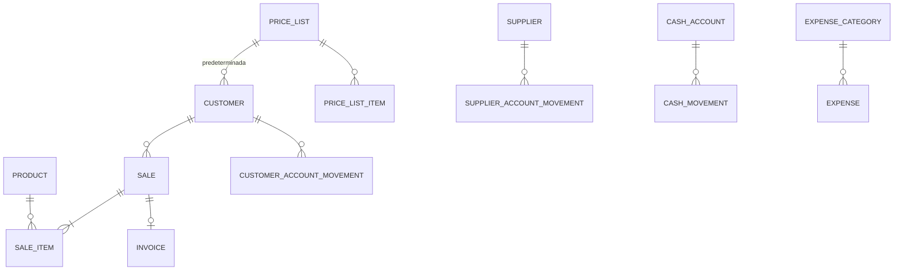

# Modelo de dominio

Este documento describe las entidades del sistema y sus relaciones. **Las de las Fases 0 a 3
existen hoy en la base.** El resto es diseño de referencia y se implementará (y podrá ajustarse) en
la fase indicada, cada una con su propia migración.

Convenciones:

- Todas las entidades de negocio tienen `company_id`, y las referencias entre ellas usan FKs
  compuestas `(company_id, id)`: la base misma impide apuntar a un registro de otra empresa.
- Identificadores UUID. Marcas de tiempo `timestamptz`. Dinero y cantidades `numeric`.
- **Maestros** (se editan, se activan/desactivan, nunca se borran) vs **transacciones**
  (documentos con estados; una vez confirmados no se borran ni editan: se cancelan o revierten con
  operaciones explícitas).
- Estados de documentos como enums con transiciones validadas; nunca banderas booleanas sueltas.

## Diagrama ER — Fases 0 a 5A (implementado)

```mermaid
erDiagram
    USER ||--o{ COMPANY_MEMBERSHIP : "pertenece a"
    COMPANY ||--o{ COMPANY_MEMBERSHIP : ""
    EMPLOYEE |o--o| COMPANY_MEMBERSHIP : "acceso del empleado"
    COMPANY_MEMBERSHIP ||--o{ MEMBERSHIP_ROLE : ""
    ROLE ||--o{ MEMBERSHIP_ROLE : ""
    ROLE ||--o{ ROLE_PERMISSION : ""
    PERMISSION ||--o{ ROLE_PERMISSION : ""
    COMPANY ||--o{ ROLE : define
    COMPANY ||--o{ EMPLOYEE : emplea
    USER ||--o{ SESSION : ""
    COMPANY ||--o{ SESSION : "trabaja en"
    USER |o--o{ AUDIT_LOG : "actor de"

    COMPANY ||--o{ CODE_SEQUENCE : ""
    COMPANY ||--o{ CUSTOMER : ""
    COMPANY ||--o{ SUPPLIER : ""
    COMPANY ||--o{ WAREHOUSE : ""
    COMPANY ||--o{ UNIT_OF_MEASURE : ""
    UNIT_OF_MEASURE |o--o{ UNIT_OF_MEASURE : "base de"
    COMPANY ||--o{ CATEGORY : ""
    CATEGORY ||--o{ RAW_MATERIAL : "tipo RAW_MATERIAL"
    CATEGORY ||--o{ PRODUCT : "tipo PRODUCT"
    UNIT_OF_MEASURE ||--o{ RAW_MATERIAL : "unidad base (raíz)"
    UNIT_OF_MEASURE ||--o{ PRODUCT : "unidad de venta"
    SUPPLIER |o--o{ RAW_MATERIAL : "preferido"

    PRODUCT ||--o| RECIPE : "receta del producto"
    RECIPE ||--o{ RECIPE_VERSION : "versiones"
    RECIPE_VERSION ||--o{ RECIPE_INGREDIENT : ""
    RAW_MATERIAL ||--o{ RECIPE_INGREDIENT : ""
    UNIT_OF_MEASURE ||--o{ RECIPE_INGREDIENT : "unidad"
    UNIT_OF_MEASURE ||--o{ RECIPE_VERSION : "unidad del rendimiento"
    RECIPE_VERSION ||--o| RECIPE_COST_SNAPSHOT : "costo al publicar"
    RECIPE_COST_SNAPSHOT ||--o{ RECIPE_COST_SNAPSHOT_LINE : "desglose"

    RAW_MATERIAL ||--o{ RAW_MATERIAL_PRESENTATION : "presentaciones de compra"
    UNIT_OF_MEASURE ||--o{ RAW_MATERIAL_PRESENTATION : "unidad de compra / contenido"
    SUPPLIER ||--o{ PURCHASE : ""
    PURCHASE ||--o{ PURCHASE_LINE : ""
    RAW_MATERIAL ||--o{ PURCHASE_LINE : ""
    RAW_MATERIAL_PRESENTATION |o--o{ PURCHASE_LINE : "de la misma materia prima"
    PURCHASE ||--o{ PURCHASE_RECEIPT : "recepciones"
    WAREHOUSE ||--o{ PURCHASE_RECEIPT : "recibe en"
    PURCHASE_RECEIPT ||--o{ PURCHASE_RECEIPT_LINE : ""
    PURCHASE_LINE ||--o{ PURCHASE_RECEIPT_LINE : "recibido de"
    PURCHASE_RECEIPT_LINE |o--o| STOCK_MOVEMENT : "genera (una vez)"
    WAREHOUSE ||--o{ STOCK_MOVEMENT : ""
    RAW_MATERIAL ||--o{ STOCK_MOVEMENT : ""
    WAREHOUSE ||--o{ STOCK_BALANCE : ""
    RAW_MATERIAL ||--o{ STOCK_BALANCE : "saldo por depósito"
    STOCK_MOVEMENT ||--o{ STOCK_BALANCE : "último aplicado"
    RAW_MATERIAL ||--o| RAW_MATERIAL_INVENTORY_COST : "costo de empresa"
    STOCK_MOVEMENT ||--o{ RAW_MATERIAL_INVENTORY_COST : "último aplicado"
    STOCK_MOVEMENT ||--|| INVENTORY_COST_HISTORY : "antes / después"

    PRODUCT ||--o{ PRODUCTION_ORDER : "se produce en"
    RECIPE_VERSION ||--o{ PRODUCTION_ORDER : "fijada al planificar"
    WAREHOUSE ||--o{ PRODUCTION_ORDER : "materias primas / producto terminado"
    EMPLOYEE |o--o{ PRODUCTION_ORDER : "responsable"
    PRODUCTION_ORDER ||--o{ PRODUCTION_MATERIAL_LINE : "RECIPE / EXTRA"
    RAW_MATERIAL ||--o{ PRODUCTION_MATERIAL_LINE : ""
    PRODUCTION_MATERIAL_LINE |o--o| STOCK_MOVEMENT : "PRODUCTION_CONSUMPTION (una vez)"
    PRODUCTION_ORDER |o--o| STOCK_MOVEMENT : "PRODUCTION_OUTPUT (una vez)"
    PRODUCT ||--o{ STOCK_MOVEMENT : ""
    PRODUCT ||--o{ STOCK_BALANCE : "saldo por depósito"
    PRODUCT ||--o| PRODUCT_INVENTORY_COST : "costo promedio material"
    STOCK_MOVEMENT ||--|| PRODUCT_INVENTORY_COST_HISTORY : "antes / lote / después"

    PRODUCT ||--o| PRODUCT_CONSERVATION_SETTINGS : "estado inicial y aviso"
    PRODUCT ||--o{ PRODUCT_CONSERVATION_PROFILE : "vida útil por estado"
    PRODUCTION_ORDER ||--o{ PRODUCT_LOT : "origen (un lote raíz)"
    PRODUCT_LOT |o--o{ PRODUCT_LOT : "lote padre (transformación)"
    WAREHOUSE ||--o{ PRODUCT_LOT : ""
    PRODUCT_LOT ||--|| PRODUCT_LOT_BALANCE : "saldo"
    PRODUCT_LOT ||--o{ STOCK_MOVEMENT : "product_lot_id"

    CUSTOMER ||--o{ CUSTOMER_ORDER : ""
    CUSTOMER_ORDER ||--|{ CUSTOMER_ORDER_LINE : "productos"
    PRODUCT ||--o{ CUSTOMER_ORDER_LINE : ""
    CUSTOMER_ORDER_LINE ||--o{ PRODUCT_LOT_RESERVATION : "reserva por lote y revisión"
    PRODUCT_LOT ||--o{ PRODUCT_LOT_RESERVATION : "comprometido"
    CUSTOMER_ORDER_LINE ||--o{ ORDER_PRODUCTION_REQUIREMENT : "falta producir"
    RECIPE_VERSION ||--o{ ORDER_PRODUCTION_REQUIREMENT : "receta fijada"
    ORDER_PRODUCTION_REQUIREMENT ||--o{ ORDER_MATERIAL_REQUIREMENT : "materia prima proyectada"
    RAW_MATERIAL ||--o{ ORDER_MATERIAL_REQUIREMENT : ""
    ORDER_PRODUCTION_REQUIREMENT |o--o{ PRODUCTION_ORDER : "source_order_requirement_id"
    CUSTOMER_ORDER ||--o{ CUSTOMER_ORDER_OPERATION : "idempotencia"
```



## Diagrama ER — fases futuras (previsto)



## Identidad, empresa y autoridad (Fases 0 y 1)

| Entidad             | Descripción                                                                                                                                              |
| ------------------- | -------------------------------------------------------------------------------------------------------------------------------------------------------- |
| `Company`           | Empresa: razón social, nombre comercial, CUIT, dirección, localidad, provincia, CP, contacto, logo, moneda (ARS), zona horaria (Buenos Aires), `active`. |
| `User`              | Identidad **global** de acceso: email único (sin distinguir mayúsculas), hash Argon2id, bloqueo global `ACTIVE`/`DISABLED`. No pertenece a una empresa.  |
| `CompanyMembership` | Pertenencia de un usuario a una empresa: estado `ACTIVE`/`DISABLED`, empleado vinculado opcional. Única por (empresa, usuario) y por empleado.           |
| `MembershipRole`    | Roles de una membresía (N:M). Lleva `company_id` para que la FK compuesta impida asignar roles de otra empresa.                                          |
| `Role`              | Rol por empresa (`code` único por empresa). `is_system` marca los 7 roles iniciales. Roles como datos.                                                   |
| `Permission`        | Catálogo global de permisos `modulo.accion`, sincronizado desde `@bakery/shared`.                                                                        |
| `RolePermission`    | N:M rol ↔ permiso.                                                                                                                                       |
| `Session`           | Sesión de servidor ligada a **una** empresa: hash del token, expiración, revocación, IP, user-agent.                                                     |
| `Employee`          | Persona que trabaja en la empresa: legajo (`EMP-0001`), documento, contacto, puesto, ingreso/egreso, estado `ACTIVE`/`INACTIVE`. Puede no tener usuario. |
| `AuditLog`          | Registro solo-inserción: actor, acción, entidad, id, metadata (sin secretos), request id, IP, timestamp.                                                 |

**Usuario ≠ empleado.** Un empleado puede no tener acceso (panadero sin usuario) y un usuario puede
no ser empleado (contador externo). Cuando existen ambos, el vínculo vive en la membresía.

**Autoridad.** Permisos efectivos de un usuario en una empresa = unión de los permisos de los roles
de su membresía activa. Login exige identidad activa y al menos una membresía activa en una empresa
activa; en el MVP la sesión toma la primera y no hay selector de empresa. "Desactivar usuario"
desactiva la membresía en esa empresa y revoca sus sesiones allí; dar de baja al empleado hace lo
mismo con su acceso. Detalle en [PERMISSIONS.md](PERMISSIONS.md).

## Maestros (Fase 1, implementado)

| Entidad         | Campos principales / notas                                                                                                                                                                                                                                                                                                       |
| --------------- | -------------------------------------------------------------------------------------------------------------------------------------------------------------------------------------------------------------------------------------------------------------------------------------------------------------------------------- |
| `CodeSequence`  | Próximo número por (empresa, tipo de código). Se incrementa con bloqueo de fila en la transacción del alta.                                                                                                                                                                                                                      |
| `Customer`      | `CLI-0001`, tipo (consumidor final, comercio, mayorista, distribuidor, otro), razón social, nombre comercial, CUIT opcional, contacto, dirección, condición comercial (contado / cuenta corriente), límite de crédito opcional, observaciones, activo. Lista de precios: Fase 5.                                                 |
| `Supplier`      | `PROV-0001`, razón social, nombre comercial, CUIT, persona de contacto, contacto, dirección, condiciones de pago, observaciones, activo.                                                                                                                                                                                         |
| `UnitOfMeasure` | Por empresa. Código, nombre, símbolo, dimensión (masa, volumen, cantidad, envase, otra), decimales. Una unidad raíz no tiene base; una derivada declara `1 u = factor × base` con base raíz de la misma dimensión. Dimensión, base y factor son inmutables. Estándar al aprovisionar: kg, g, l, ml, unidad, docena, bolsa, caja. |
| `Category`      | Una tabla con `type` `RAW_MATERIAL` / `PRODUCT`; nombre único por empresa y tipo; orden; activo.                                                                                                                                                                                                                                 |
| `RawMaterial`   | `MP-0001`, nombre, categoría (tipo materia prima), unidad base **raíz**, stock mínimo, proveedor preferido, costo de referencia por unidad base (`referenceCost`, origen `MANUAL_REFERENCE`, fecha de actualización; permiso propio), activo. **Sin columna de stock.**                                                          |
| `Product`       | `PROD-0001`, nombre, categoría (tipo producto), unidad de venta, precio de venta, controla stock, imagen, descripción, activo. **Sin costo**: saldrá de la receta (Fase 2).                                                                                                                                                      |
| `Warehouse`     | `DEP-0001`, nombre, dirección, descripción, activo. Cada empresa nace con "Depósito Principal". Desde Fase 3 tiene saldos y movimientos de stock.                                                                                                                                                                                |

Códigos: se generan por empresa y tipo si el usuario no los indica; también se aceptan manuales.
Se guardan en mayúsculas con `UNIQUE (company_id, código)`. Los nombres y el CUIT no son únicos.

## Recetas (Fase 2, implementado)

| Entidad                  | Campos principales / notas                                                                                                                                                                                                                                   |
| ------------------------ | ------------------------------------------------------------------------------------------------------------------------------------------------------------------------------------------------------------------------------------------------------------ |
| `Recipe`                 | Producto (una receta activa por producto), nombre, descripción, activa, `lastVersionNumber` (contador: los números de versión no se reutilizan aunque se descarte un borrador).                                                                              |
| `RecipeVersion`          | Número (único por receta), estado `DRAFT` / `ACTIVE` / `ARCHIVED`, rendimiento y unidad de rendimiento, merma teórica % opcional (0 ≤ x < 100, informativa), instrucciones, vigente desde / hasta, publicada por y cuándo, archivada cuándo, creada por.     |
| `RecipeIngredient`       | Materia prima (una vez por versión), cantidad > 0, unidad (compatible con la unidad base de la materia prima), orden, notas.                                                                                                                                 |
| `RecipeCostSnapshot`     | Uno por versión publicada: moneda, estado (`COMPLETE` / `INCOMPLETE`), costo del lote, rendimiento, rendimiento normalizado, unidades (código y símbolo copiados), costo por unidad de venta, precio de venta de ese momento, fecha de cálculo. Append-only. |
| `RecipeCostSnapshotLine` | Desglose por ingrediente: materia prima (código y nombre copiados), cantidad y unidad, cantidad normalizada y unidad base, costo de referencia usado, origen del costo, costo del ingrediente (null si faltaba costo). Append-only.                          |

**Ciclo de vida.** Una receta nace con un borrador (v1). Publicar un borrador lo vuelve `ACTIVE`,
archiva la vigente anterior y guarda el snapshot de costo, todo en una transacción. Para cambiar
una receta publicada se crea una nueva versión (copia de la vigente u otra), que nace `DRAFT`. Hay
como máximo una versión `ACTIVE` y un `DRAFT` por receta. Un borrador se puede editar o descartar;
una versión `ACTIVE` o `ARCHIVED` no se modifica ni se borra (lo impide la base con triggers, ver
ADR-021). Archivar la vigente sin reemplazo deja la receta sin versión vigente.

**Unidades.** La cantidad de cada ingrediente se carga en cualquier unidad con la misma raíz que la
unidad base de la materia prima (g para harina en kg). El rendimiento se carga en una unidad con la
misma raíz que la unidad de venta del producto. No hay conversión entre dimensiones ni "envase
genérico → kg": el packaging específico por artículo se resolvió en Fase 3 con presentaciones de
compra por materia prima (ADR-030), que se usan sólo en compras; las recetas siguen en unidades de
la misma raíz que la unidad base.

**Costo teórico** (todo en decimal, sin redondeos intermedios):

```
costo ingrediente = cantidad normalizada a unidad base × costo efectivo por unidad base
costo del lote    = Σ costo ingrediente                         (null si falta algún costo)
costo unitario    = costo del lote ÷ rendimiento normalizado a la unidad de venta
margen bruto      = precio de venta − costo unitario            (MARGEN BRUTO TEÓRICO)
margen %          = margen bruto ÷ precio de venta × 100        (null si el precio es 0)
```

La merma teórica es informativa: el rendimiento ya es la producción útil, así que no se descuenta
otra vez. Si falta el costo de algún ingrediente el estado es `INCOMPLETE` y lote, unitario y
margen son `null` (nunca 0).

**Costo efectivo** (desde Fase 3, ADR-031): el costo por unidad base que usan las recetas sale de
una función de dominio explícita, `selectEffectiveCost`, con esta prioridad:

1. promedio ponderado móvil de inventario, si existe → origen `PURCHASE_MOVING_AVERAGE`;
2. si no, costo de referencia manual → origen `MANUAL_REFERENCE`;
3. si no, sin costo → la receta queda `INCOMPLETE` (nunca 0).

**Costos distintos** (no confundir):

| Concepto                 | Qué es                                                                                                                                           | Dónde vive                                   |
| ------------------------ | ------------------------------------------------------------------------------------------------------------------------------------------------ | -------------------------------------------- |
| `referenceCost`          | Costo por unidad base de una materia prima, cargado a mano (`MANUAL_REFERENCE`). Se conserva y sigue editable aunque exista promedio.            | `raw_materials.reference_cost`               |
| `movingAverageCost`      | Promedio ponderado móvil del inventario de la materia prima a nivel empresa, derivado de ingresos valorizados (compras, stock inicial, ajustes). | `raw_material_inventory_costs`               |
| `effectiveCost`          | Costo que usan las recetas hoy: `movingAverageCost` si existe, si no `referenceCost`, si no ninguno. Viaja con su origen.                        | Calculado al pedirlo (`selectEffectiveCost`) |
| `snapshotCost`           | Costo de una versión calculado y congelado al publicarla, con los costos efectivos de ese momento y su origen por línea.                         | `recipe_cost_snapshots` (+ líneas)           |
| `currentTheoreticalCost` | Costo de una versión recalculado ahora con los costos efectivos actuales. Se compara con el snapshot.                                            | Calculado al pedirlo (no se guarda)          |

Los snapshots publicados antes de Fase 3 no cambian (append-only); los nuevos guardan
`PURCHASE_MOVING_AVERAGE` como origen cuando corresponde. En las líneas del snapshot, la columna
`reference_cost` significa "costo usado" (deuda de nombre, ADR-031).

## Compras (Fase 3, implementado)

| Entidad                   | Campos principales / notas                                                                                                                                                                                                                                                                                                   |
| ------------------------- | ---------------------------------------------------------------------------------------------------------------------------------------------------------------------------------------------------------------------------------------------------------------------------------------------------------------------------- |
| `RawMaterialPresentation` | Presentación de compra de **una** materia prima: nombre (único por materia prima), unidad de compra (bolsa), cantidad contenida > 0 y su unidad (25 kg), activa. La unidad contenida debe ser compatible con la unidad base. La conversión es inmutable: sólo se renombra o se desactiva/activa.                             |
| `Purchase`                | `OC-0001`, proveedor, nro. de documento del proveedor, fecha, fecha esperada, estado, moneda, notas, subtotal, descuento total, impuestos (informativos), total, quién la creó / pidió / canceló y cuándo, motivo de cancelación.                                                                                            |
| `PurchaseLine`            | Número de línea, materia prima, presentación opcional (de esa materia prima), unidad de compra, cantidad pedida > 0, precio unitario, bruto, descuento (≤ bruto), neto = bruto − descuento, factor a unidad base **congelado** (`base_quantity_per_unit`), cantidad base pedida y cantidad recibida (0 ≤ recibida ≤ pedida). |
| `PurchaseReceipt`         | `REC-0001`, compra, depósito, fecha de recepción, estado `DRAFT` / `POSTED` / `CANCELLED`, nro. de remito, notas, quién la cargó y quién la confirmó.                                                                                                                                                                        |
| `PurchaseReceiptLine`     | Línea de compra recibida (una vez por recepción): pedido, recibido antes, recibido ahora en unidad de compra, presentación, cantidad normalizada a unidad base, costo de adquisición por unidad base y valor de inventario de la línea. Se recalcula y congela al confirmar.                                                 |

**Estados.**

```
Compra:     DRAFT ──pedir──▶ ORDERED ──recepción──▶ PARTIALLY_RECEIVED ──recepción──▶ RECEIVED
              └──cancelar──▶ CANCELLED ◀──cancelar── ORDERED (sólo sin recepciones confirmadas)
Recepción:  DRAFT ──confirmar──▶ POSTED (inmutable)      DRAFT ──descartar──▶ CANCELLED
```

- Crear una compra **no** mueve stock: sólo una recepción confirmada lo hace.
- Una compra en `DRAFT` se edita completa; para pedirla necesita al menos una línea y un proveedor
  activo. Una vez pedida, sólo cambian notas, fecha esperada y documento del proveedor; sus líneas
  sólo cambian en la cantidad recibida (lo impone un trigger). Una compra que salió de `DRAFT` no
  se borra.
- Sólo `ORDERED` y `PARTIALLY_RECEIVED` reciben. Cuando todas las líneas están completas, la compra
  pasa a `RECEIVED`.
- Cancelar descarta las recepciones en borrador y sólo se permite sin mercadería recibida
  (`409 PURCHASE_HAS_RECEIPTS`); las devoluciones a proveedor y el "cerrar con faltante" no existen
  todavía (ADR-038).
- **Sin estado de pago ni cuenta del proveedor en Fase 3**: cuentas a pagar, pagos y
  `SupplierAccountMovement` llegan en Fase 6.

**Presentaciones y conversión.** La equivalencia pertenece a materia prima + presentación: no hay
una conversión universal de "bolsa" (ADR-030). Para una línea:

```
con presentación:  base_por_unidad = cantidad contenida convertida a la unidad base (Bolsa 25 kg → 25 kg)
sin presentación:  la unidad de compra debe ser compatible con la base;  base_por_unidad = convert(1, unidad → base)
cantidad base     = cantidad × base_por_unidad                          (4 bolsas × 25 kg = 100 kg)
```

El factor se congela en la línea al guardarla, así que cambios posteriores no reinterpretan una
compra. Una FK compuesta `(company_id, raw_material_id, presentation_id)` hace imposible usar la
presentación de otra materia prima.

**Importes y costo de adquisición** (ADR-032):

```
bruto      = cantidad × precio unitario
neto       = bruto − descuento                                 (descuento ≤ bruto)
subtotal   = Σ bruto;   descuento total = Σ descuentos
total      = subtotal − descuento total + impuestos            (impuestos informativos)
costo de adquisición por unidad base = neto de la línea ÷ cantidad base pedida
                                     (4 × $20.000 = $80.000 ÷ 100 kg = $800/kg)
```

Los impuestos no entran al costo de inventario. Una recepción parcial se valoriza al mismo costo
unitario de la línea.

## Inventario (Fase 3, implementado)

| Entidad                    | Campos principales / notas                                                                                                                                                                                                                                                                                                          |
| -------------------------- | ----------------------------------------------------------------------------------------------------------------------------------------------------------------------------------------------------------------------------------------------------------------------------------------------------------------------------------- |
| `StockMovement`            | **Ledger append-only y autoritativo.** Secuencia, depósito, tipo de ítem (`RAW_MATERIAL`; `PRODUCT` preparado), materia prima, tipo de movimiento, cantidad **con signo** en unidad base, costo unitario, valor con signo, saldo del depósito después, fecha, referencia (tipo + id + línea de origen), motivo, actor, observación. |
| `StockBalance`             | Proyección: saldo por empresa + depósito + ítem, en unidad base (≥ 0), último movimiento aplicado.                                                                                                                                                                                                                                  |
| `RawMaterialInventoryCost` | Proyección a nivel **empresa** por materia prima: cantidad total, valor de inventario, promedio ponderado móvil (null si nunca hubo ingreso valorizado), último movimiento aplicado.                                                                                                                                                |
| `InventoryCostHistory`     | Append-only, una fila por movimiento: cantidad, valor y promedio antes y después, tipo, referencia y actor.                                                                                                                                                                                                                         |

**El stock es la suma de movimientos** (ADR-026/027). Los saldos y el costo de empresa se
actualizan en la misma transacción que el movimiento y los triggers de la base rechazan cualquier
cambio que no sea exactamente "anterior + movimiento nuevo". No hay columna de stock editable en
`raw_materials`.

**Tipos de movimiento y signo** (ADR-028). La cantidad se guarda con signo en la unidad base:

| Tipo                  | Signo | Origen                                                     | Motivo                                                      |
| --------------------- | ----- | ---------------------------------------------------------- | ----------------------------------------------------------- |
| `INITIAL_STOCK`       | +     | Stock inicial (con costo obligatorio)                      | —                                                           |
| `PURCHASE_RECEIPT`    | +     | Línea de una recepción confirmada (referencia obligatoria) | —                                                           |
| `ADJUSTMENT_POSITIVE` | +     | Ajuste manual                                              | `PHYSICAL_COUNT`, `DATA_CORRECTION`, `BREAKAGE`, `OTHER`    |
| `ADJUSTMENT_NEGATIVE` | −     | Ajuste manual                                              | ídem                                                        |
| `WASTE`               | −     | Merma                                                      | `EXPIRED`, `DAMAGED`, `PRODUCTION_LOSS`, `QUALITY`, `OTHER` |

Un CHECK exige signo, valor y motivo coherentes con el tipo. `PRODUCTION_CONSUMPTION`,
`PRODUCTION_OUTPUT`, `SALE` y `RETURN` están **reservados**: no existen en el enum de la base y se
agregarán cuando exista su flujo (Fases 4 y 5). Stock inicial, ajustes y mermas no tienen tabla de
documento: el movimiento es el documento (ADR-037).

**Promedio ponderado móvil** por materia prima a nivel empresa (ADR-029), con decimal.js:

```
ingreso:  si OldQty = 0 → NewAvg = costo del ingreso        (no arrastra un promedio sin existencia)
          si no         → NewAvg = (OldValue + Qty × Cost) ÷ (OldQty + Qty)
          NewValue = OldValue + Qty × Cost
salida:   NewAvg = OldAvg                                   (merma y ajuste negativo no cambian el promedio)
          NewValue = OldValue − Qty × OldAvg;  si la cantidad queda en 0, el valor queda en 0
```

Ejemplo: 100 kg @ $1.000 + 100 kg @ $1.200 → 200 kg @ $1.100 ($220.000); merma de 10 kg sobre
100 kg @ $1.000 → 90 kg @ $1.000 ($90.000). El promedio se redondea a 6 decimales (HALF_UP); el
valor es el acumulado de los valores de los movimientos.

**Reglas de valorización de las operaciones manuales:**

- **Stock inicial**: exige costo unitario; se carga una sola vez por materia prima y depósito (si
  ya hay movimientos ahí, `409 INITIAL_STOCK_ALREADY_LOADED`: se corrige con un ajuste).
- **Ajuste positivo**: sin costo indicado entra al promedio vigente (no lo cambia); si no hay
  promedio, exige costo (`422 VALUATION_COST_REQUIRED`).
- **Ajuste negativo y merma**: salen al promedio vigente; no aceptan costo.
- Los ingresos requieren la materia prima activa; las salidas se permiten aunque esté desactivada.

**Stock negativo prohibido** (ADR-035): una salida que no alcanza en el depósito (o en el total
de la empresa) falla con `409 INSUFFICIENT_STOCK`; además, `CHECK (quantity >= 0)` en saldos y
costo de empresa.

**Stock mínimo.** El estado se calcula contra el total de la empresa y el mínimo de la materia
prima: `OUT_OF_STOCK` si no hay existencia; `LOW` si hay menos que el mínimo (mínimo > 0); si no,
`OK`. El faltante es `mínimo − existencia` (0 si no falta). La vista "Bajo mínimo" incluye las sin
stock con mínimo y muestra el proveedor preferido.

## Producción (Fase 4, implementado)

**Orden de producción = lote** (ADR-039). `production_orders`: código `OP-0001`, producto,
receta y versión, depósito de materias primas y de producto terminado, fecha programada, cantidad
planificada (como se ingresó + unidad + normalizada a la unidad de venta), factor de escala, merma
teórica de la versión (sólo referencia), cantidad real (ídem), lote opcional `LOT-AAAAMMDD-NNN`
(único por empresa, se genera al planificar), responsable (empleado activo), actor y fecha de cada
transición, motivo de cancelación y notas. El **snapshot de costos** son columnas de la orden:
`planned_material_cost`, `planned_unit_material_cost`, `planned_cost_status` (al planificar) y
`actual_material_cost`, `actual_unit_material_cost` (al completar).

`production_material_lines`: `RECIPE` (derivadas de la receta al planificar) o `EXTRA` (agregadas en
curso, motivo obligatorio, nunca cambian la receta). Plan (cantidad, unidad, normalizada a la unidad
base, costo unitario, origen, costo), real (cantidad en unidad compatible, normalizada), costo real,
variación y movimiento de consumo.

**Ciclo de vida.**

```
DRAFT → PLANNED → IN_PROGRESS → COMPLETED
DRAFT | PLANNED | IN_PROGRESS → CANCELLED
```

| Estado        | Qué se puede hacer                                                             | Stock |
| ------------- | ------------------------------------------------------------------------------ | ----- |
| `DRAFT`       | Editar todo; el plan se calcula en vivo (no se guarda).                        | No    |
| `PLANNED`     | Versión, líneas y costo esperado fijos; sólo responsable, lote y notas.        | No    |
| `IN_PROGRESS` | Cargar consumo real (unidad compatible), extras y salida real; guardar avance. | No    |
| `COMPLETED`   | Nada: hecho histórico (409 `PRODUCTION_IMMUTABLE`, trigger en la base).        | Sí    |
| `CANCELLED`   | Nada.                                                                          | No    |

**Fijación de receta** (ADR-040): la versión sugerida es la vigente para la fecha programada; en
DRAFT se puede elegir otra publicada; al planificar queda fija y una versión nueva no la cambia.

**Cantidades.** `scaleFactor = salida planificada normalizada / rendimiento normalizado`; cada
ingrediente = cantidad de receta × factor, normalizada a la unidad base de la materia prima. Real:
la unidad debe ser compatible (`INCOMPATIBLE_UNITS`); variación = real − plan (y %).
Rendimiento: `variación = real − plan`, `rendimiento = real / plan × 100`. No se genera `WASTE` por
rendimiento: un rendimiento menor sube el costo unitario.

**Producto producible.** De la empresa, activo, con receta y `controls_stock = true`
(`PRODUCT_NOT_STOCK_CONTROLLED`). Una orden en curso puede completarse aunque el producto se haya
desactivado después. Una materia prima dada de baja en la receta bloquea planificar e iniciar.

**Disponibilidad.** Necesario / disponible / diferencia por materia prima en el depósito de origen
(plan en DRAFT/PLANNED, consumo cargado en IN_PROGRESS). Planificar se permite con faltante;
iniciar no (`INSUFFICIENT_MATERIALS_FOR_PRODUCTION`). No hay reservas: completar revalida
(`INSUFFICIENT_STOCK`).

**Costos — cuatro conceptos distintos.**

| Concepto                | Dónde                        | Cuándo se fija          | Fuente                                                 |
| ----------------------- | ---------------------------- | ----------------------- | ------------------------------------------------------ |
| Costo teórico           | Receta / snapshot de versión | Al publicar (o en vivo) | Costo efectivo (promedio → referencia)                 |
| Costo esperado          | Orden planificada            | DRAFT → PLANNED         | Costo efectivo de ese momento, por línea con su origen |
| Costo material real     | Orden completada             | Al completar            | Σ `total_value` de los `PRODUCTION_CONSUMPTION`        |
| Costo promedio material | Inventario del producto      | Con cada producción     | Promedio ponderado móvil de los lotes (`applyInbound`) |

En curso se muestra además un **costo estimado** (consumo cargado × promedio actual), que no se
guarda. Costo unitario real = costo material real / salida real. Ninguno incluye mano de obra,
energía ni indirectos.

**Completar** (ADR-041/042): una transacción con locks en orden fijo; consumos al promedio vigente
(sin cambiarlo), salida valorizada exactamente con el costo real, promedio e historial del
producto (`product_inventory_costs`, `product_inventory_cost_history`), auditoría
`PRODUCTION_ORDER_COMPLETED` y `PRODUCT_MOVING_AVERAGE_COST_CHANGED`. Sin reversión
(`PRODUCTION_REVERSAL`).

**Producto terminado en inventario.** `stock_balances` y `stock_movements` ya eran genéricos desde
0006 (`item_type`, exactamente uno de `raw_material_id` / `product_id`); Fase 4 los usa para
`PRODUCT`. El producto sale de Fase 4 con stock por depósito, costo promedio material, valor de
inventario e historial, listo para el costo de venta de Fase 5.

## Lotes, conservación y vida útil (Fase 4.5, implementado)

**Perfil de conservación** (`product_conservation_settings` + `product_conservation_profiles`):
por producto y estado (`FRESH`, `REFRIGERATED`, `FROZEN`, `THAWED`): habilitado, vida útil en
minutos (la UI la expresa en horas o días), "puede ser inicial" y notas; por producto, el estado
inicial por defecto y el umbral de "próximo a vencer". Nada está fijo en el código. Sin perfil, un
lote nace `FRESH` sin vencimiento (`usable_until` null: "vida útil desconocida", se cuenta como
utilizable y se informa aparte).

**Lote** (`product_lots`): nace al completar una orden (código = `batch_code`; si la orden no
tenía, se genera al completar), o de una transformación (hijo con `parent_lot_id`, código
`<padre>.<n>`, misma orden de origen). Guarda depósito, estado de conservación, `produced_at`,
`state_changed_at`, vida útil y `usable_until = state_changed_at + vida útil` (calculado al nacer,
inmutable), cantidad y valor iniciales, costo unitario material, estado de calidad (`AVAILABLE` /
`BLOCKED` con motivo) y el `operation_id` que lo creó. No se borra nunca.

**Saldo por lote** (`product_lot_balances`): proyección de los movimientos del lote (cantidad y
valor). Σ saldos de lote = `stock_balances` del producto y depósito = `product_inventory_costs`.

**Estado operativo derivado** (no se persiste, se calcula al consultar): `DEPLETED` (saldo 0) >
`BLOCKED` > `EXPIRED` (`at > usable_until`) > `NEAR_EXPIRY` (vence dentro del umbral) >
`AVAILABLE`. "Utilizable a una fecha" = no agotado, no bloqueado y no vencido en esa fecha.

**Transiciones** (ADR-045): `FRESH → FROZEN`, `REFRIGERATED → FROZEN`, `FROZEN → THAWED`; el
estado destino debe estar habilitado. `THAWED → FROZEN` nunca (no se recongela). Fresco →
refrigerado queda fuera del MVP. Una transformación es parcial: el origen baja, nace un lote hijo
con el vencimiento del estado destino contado desde ahora; `LOT_TRANSFORMATION_OUT` (−q) y
`LOT_TRANSFORMATION_IN` (+q) al costo del lote, neto cero en cantidad y valor, sin cambiar el
promedio ni agregar costo. Un lote vencido, bloqueado o agotado no se transforma.

**Merma por lote**: `WASTE` con motivo `EXPIRED` / `DAMAGED` / `QUALITY` / `OTHER`, valorizada al
costo del lote (si se agota, exactamente su valor restante); baja cantidad y valor del producto sin
cambiar el promedio. Admite lotes vencidos o bloqueados.

**FEFO**: `usable_until` ascendente (sin vencimiento al final), luego `produced_at`. Ordena los
lotes, la disponibilidad y la recomendación (`recommendFefo`); todavía no consume (no hay ventas
ni reservas).

**Disponibilidad a una fecha** (`calculateProductAvailabilityAt(productId, warehouse?, at)`):
físico, utilizable, no utilizable por motivo (vencido / bloqueado), por estado de conservación,
cantidad sin vida útil configurada y cada lote con su rango FEFO. Ejemplo: 700 kg físicos, 300
frescos que vencen el viernes y 400 congelados → el sábado son utilizables 400.

## Pedidos, demanda comprometida y necesidades (Fase 5A, implementado)

**Pedido** (`customer_orders`): código `PED-0001` por empresa, cliente, `requested_at`
(`timestamptz`; se carga y se muestra como hora de pared de `Company.timezone`, ADR-055),
retiro/entrega (`PICKUP` / `DELIVERY` con dirección propia), contacto, evento, prioridad (`NORMAL`
/ `HIGH` / `URGENT`: sólo ordena y avisa), notas, `plan_revision` y quién/cuándo creó, confirmó,
empezó la preparación, marcó listo o canceló. No se borra.

**Ciclo de vida** (`status`): `DRAFT → CONFIRMED → IN_PREPARATION → READY`; `READY →
IN_PREPARATION` (volver a preparación o replan que deja de cubrir); cualquiera salvo `CANCELLED` →
`CANCELLED` (terminal; `READY` sólo con confirmación explícita). No hay `DELIVERED`: la entrega
convierte el pedido en venta en Fase 5B. Sólo `CONFIRMED`, `IN_PREPARATION` y `READY` son demanda.
`READY` exige cobertura completa.

**Cobertura** (`coverage_status`, separada del estado): `FULLY_COVERED` (todo reservado),
`PARTIALLY_COVERED` (algo reservado, falta producir), `NOT_COVERED` (nada reservado),
`NEEDS_REPLAN` (alguna reserva de la revisión vigente fue invalidada por calidad o merma; se deriva
al consultar, ADR-053). `null` en borrador.

**Línea** (`customer_order_lines`): producto, cantidad > 0 y unidad compatible con la unidad de
venta (normalizada a la de venta), conservación pedida (`ANY` o un estado), notas y orden. En
borrador se reemplazan; confirmado, una línea quitada por replan queda con `removed_at`.

**Cantidades por producto para una fecha** (`packages/domain/src/orders.ts`): `PHYSICAL` = saldo;
`ELIGIBLE` = físico de lotes no agotados, no bloqueados, no vencidos en `requested_at` y con la
conservación pedida; `COMMITTED` = Σ reservas activas de otros pedidos sobre esos lotes;
`AVAILABLE = ELIGIBLE − COMMITTED`. Reserva = `min(pedido, AVAILABLE)` asignada por FEFO
(`usable_until`, `produced_at`, código); falta producir = pedido − reservado.

**Reserva** (`product_lot_reservations`, ADR-050): pedido, línea, lote, cantidad (unidad de venta),
`plan_revision`, estado `ACTIVE` → `RELEASED` (cancelación o replan) / `INVALIDATED` (lote
bloqueado o merma) / `FULFILLED` (Fase 5B), motivo y fechas. No mueve stock ni se borra. Σ activas
≤ saldo del lote; ningún lote bloqueado con reservas activas.

**Necesidad de producción** (`order_production_requirements`): línea, producto, cantidad, receta y
versión vigentes al confirmar o replanificar (fijadas; una versión nueva sólo entra con un replan,
y el pedido avisa "receta nueva publicada"), problema `NO_RECIPE_FOR_PRODUCTION` /
`RECIPE_NOT_USABLE` (sin ingredientes inventados: queda "sin cubrir"), `plan_revision`, estado
`OPEN → PRODUCTION_CREATED → SATISFIED` o `CANCELLED`, y la orden de producción vinculada.

**Materias primas proyectadas** (`order_material_requirements`, ADR-051): por necesidad, materia
prima y cantidad en su unidad base, calculadas con el escalado de Producción (100 kg = 75 kg harina

- 0,8 kg sal → para 200 kg: 150 y 1,6). No reservan ni mueven stock. `calculateMaterialDemand`
  suma la demanda de todos los pedidos que son demanda (con horizonte) contra el stock actual.

**Pedido → necesidad → orden de producción** (ADR-056): `production_orders.source_order_requirement_id`.
Crear la orden desde la necesidad la pasa a `PRODUCTION_CREATED`; cancelarla la devuelve a `OPEN`;
completarla la deja `SATISFIED` y el lote nuevo aparece como stock nuevo para un replan.

**REPLAN** (ADR-052): libera reservas y cierra necesidades de la revisión vigente, incrementa
`plan_revision` y vuelve a planificar con los cambios; la historia se conserva. Calidad y merma
invalidan reservas y dejan el pedido `NEEDS_REPLAN`; lo comprometido no se transforma (ADR-054).

## Ventas y cuentas (Fases 5B–6)

- `Sale` (`DRAFT`/`CONFIRMED`/`PARTIALLY_PAID`/`PAID`/`CANCELLED`) + `SaleItem`. Confirmar descuenta
  stock una sola vez; cancelar genera movimientos inversos.
- `PriceList` + `PriceListItem`; cada cliente con lista predeterminada.
- `CustomerAccountMovement` (`SALE`, `PAYMENT`, `CREDIT_NOTE`, `ADJUSTMENT`) y
  `SupplierAccountMovement` (`PURCHASE`, `PAYMENT`, `DEBIT`, `CREDIT`, `ADJUSTMENT`): el saldo es la
  suma del ledger.
- `CashAccount` + `CashMovement` (`SALE_INCOME`, `CUSTOMER_PAYMENT`, `SUPPLIER_PAYMENT`, `EXPENSE`,
  `ADJUSTMENT`, `OTHER_INCOME`, `OTHER_EXPENSE`), medios de pago (efectivo, transferencia, débito,
  crédito, cuenta corriente, otro). Resumen diario.
- `Expense` + `ExpenseCategory`.

## Facturación (Fase 7)

`Invoice` (venta, cliente, tipo, número, fecha, subtotal, impuestos, total, estado). Emisión a
través de la interfaz `TaxInvoiceProvider`; implementación inicial `InternalInvoiceProvider`. La
integración fiscal argentina (`ArgentinaFiscalInvoiceProvider`) es un milestone aparte.

## Invariantes críticas

| Área         | Invariante                                                                                                  | Cómo se garantiza / testea                                                                                                                                                                                                     |
| ------------ | ----------------------------------------------------------------------------------------------------------- | ------------------------------------------------------------------------------------------------------------------------------------------------------------------------------------------------------------------------------ |
| Auditoría    | Las operaciones sensibles registran actor y timestamp. El log no se altera.                                 | **Fase 0:** trigger que rechaza UPDATE/DELETE. **Fase 1:** cada alta/cambio/baja de maestro audita en la misma transacción (tests por entidad).                                                                                |
| Seguridad    | Autorización validada en backend por permiso.                                                               | **Fase 0/1:** matriz rol × endpoint verificada contra la API (`authorization.test.ts`).                                                                                                                                        |
| Tenancy      | Ningún dato cruza empresas.                                                                                 | **Fase 1:** empresa tomada solo de la sesión; FKs compuestas; tests Empresa A/B (leer, modificar, inferir, referenciar).                                                                                                       |
| Maestros     | Nada se borra; se desactiva. Usuario ≠ empleado.                                                            | **Fase 1:** sin endpoints DELETE; tests de desactivación y de baja de empleado con acceso.                                                                                                                                     |
| Unidades     | Solo se convierte dentro de la misma raíz; masa ↔ volumen se rechaza.                                       | **Fase 1:** `@bakery/domain` con decimal.js; tests unitarios e integración (422 `INCOMPATIBLE_UNITS`).                                                                                                                         |
| Inventario   | Todo cambio de stock tiene un `StockMovement`; el stock nunca es negativo.                                  | **Fase 3:** ledger append-only y saldos/costo custodiados por triggers, CHECK ≥ 0, `INSUFFICIENT_STOCK`; `inventory-invariants.test.ts` (1–3, 7, 21).                                                                          |
| Producción   | Completar genera consumo + salida en una única transacción.                                                 | **Fase 4:** `completeOrder` en una transacción con locks en orden fijo; test §73 fuerza una falla después de los consumos (trigger temporal) y verifica que nada cambió; idempotencia `[200, 409, 409]`.                       |
| Recetas      | Una versión publicada es inmutable; una vigente y un borrador por receta.                                   | **Fase 2:** triggers en la base + índices únicos parciales; tests de integración (v1 intacta tras v2, UPDATE/DELETE directos rechazados).                                                                                      |
| Costo        | Falta de costo ≠ costo cero; el snapshot no cambia con los costos.                                          | **Fase 2:** dominio devuelve `INCOMPLETE`/null; snapshots append-only por trigger; unit, integración y E2E de costo incompleto. **Fase 3:** el snapshot tampoco cambia con el promedio de compras (test §62, E2E pasos 16–17). |
| Compras      | Una recepción confirmada afecta stock una sola vez y no se modifica.                                        | **Fase 3:** estado verificado con lock + único `(company_id, source_line_id)` + triggers de inmutabilidad; tests de doble confirmación, rollback y concurrencia.                                                               |
| Ventas       | Una venta confirmada afecta stock una sola vez.                                                             | Fase 5B: ídem.                                                                                                                                                                                                                 |
| Costos       | Producciones históricas conservan snapshot de costos.                                                       | **Fase 4:** costos esperado y real son columnas de la orden, inmutables tras completar (trigger `production_orders_guard`); tests de UPDATE directo rechazado.                                                                 |
| Lotes        | Σ lotes = saldo agregado = costo del producto; todo movimiento de producto tiene lote; un lote no se borra. | **Fase 4.5:** check `stock_movements_product_lot`, triggers `product_lots_guard` y `product_lot_balances_guard`, `reconciliationProblems` después de cada operación en `product-lots.test.ts`, migración con BLOCKER.          |
| Conservación | Transformar no cambia cantidad total, valor ni promedio; lo descongelado no se recongela.                   | **Fase 4.5:** `LOT_TRANSFORMATION_OUT/IN` al costo del lote; dominio `assertTransformation`; tests §52–53.                                                                                                                     |
| Reservas     | Σ reservas activas ≤ saldo del lote; lote bloqueado sin reservas activas; reservar no mueve stock.          | **Fase 5A:** triggers `product_lot_reservations_capacity`, `product_lot_balances_reserved`, `product_lots_blocked_reserved`; locks ADR-053; concurrencia 70 + 70 sobre 100 (`orders-access.test.ts`).                          |
| Pedidos      | Confirmar y replanificar son atómicos e idempotentes; la historia de reservas y necesidades no se borra.    | **Fase 5A:** una transacción por operación; `customer_order_operations`; triggers de guarda (sin DELETE, reservas y necesidades inmutables salvo estado); test de rollback con falla inyectada.                                |
| Caja         | Todo movimiento financiero relevante es trazable a su origen.                                               | Fase 6: referencia obligatoria salvo movimientos manuales con motivo.                                                                                                                                                          |
